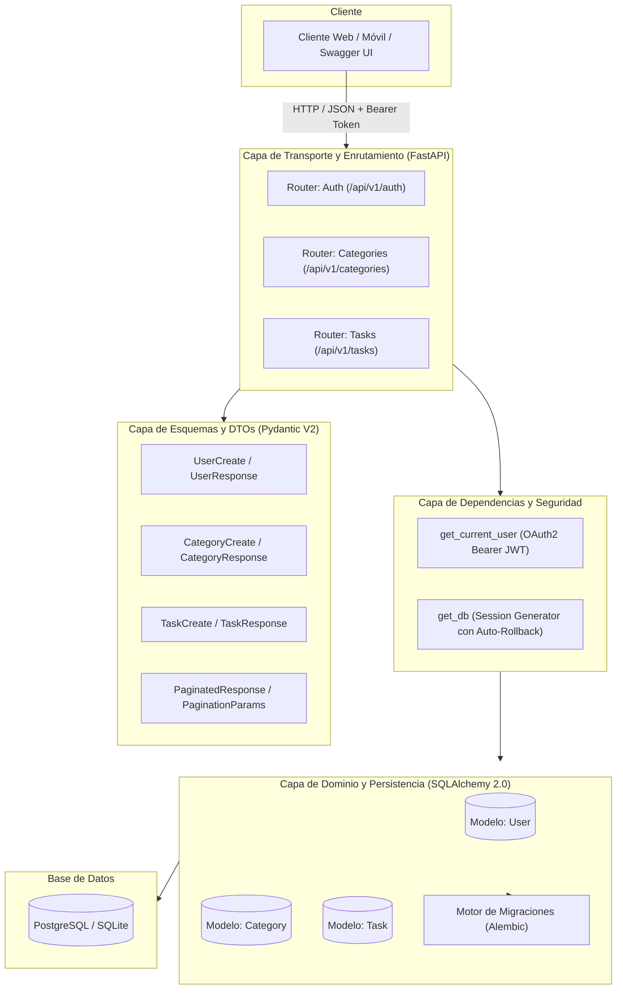
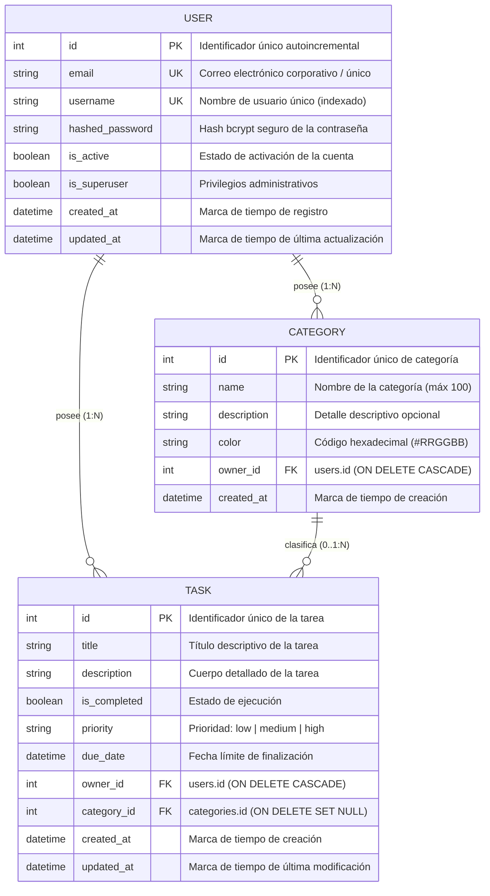
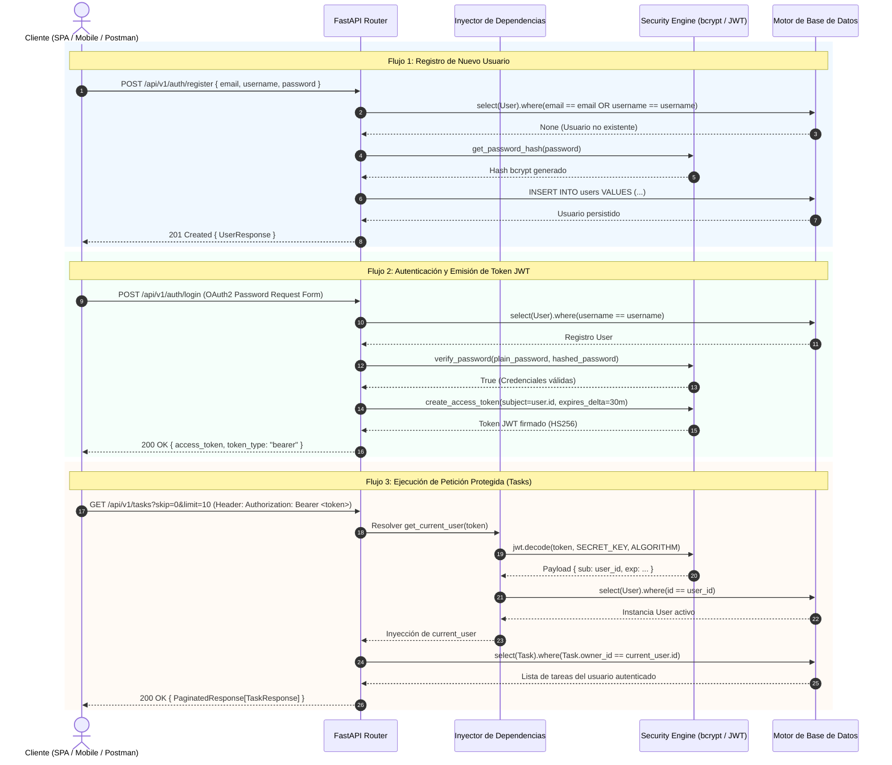
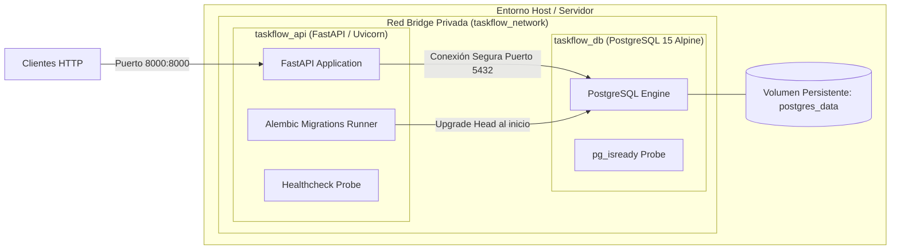

# Documento de Arquitectura de Software — TaskFlow API

**Versión:** 1.0.0  
**Estado:** Activo  
**Stack Principal:** Python 3.10+, FastAPI, SQLAlchemy 2.0, Pydantic V2, PostgreSQL / SQLite, Docker  

---

## 1. Visión General y Principios de Diseño

**TaskFlow API** es un servicio backend RESTful de alto rendimiento diseñado para la gestión integral de tareas, categorías y usuarios bajo un modelo de aislamiento estricto por propietario (*multi-tenancy lógico a nivel de usuario*).

### Principios Rectores:
1. **Arquitectura en Capas (Layered Architecture):** Separación rigurosa entre transporte HTTP, validación de esquemas, lógica de negocio y persistencia de datos.
2. **Tipado Estricto y Validación en los Límites (Type Safety & Boundary Validation):** Empleo de **Pydantic V2** para contratos de entrada/salida y **SQLAlchemy 2.0** (`Mapped`, `mapped_column`) para garantizar consistencia estática y en tiempo de ejecución.
3. **Seguridad Integral (Defense in Depth & BOLA Mitigation):** Protección de recursos mediante tokens **JWT (JSON Web Tokens)** y hashing criptográfico **bcrypt**, asegurando que ningún usuario pueda acceder, modificar o eliminar recursos de terceros (*Broken Object Level Authorization*).
4. **Resiliencia y Portabilidad Contenerizada:** Diseño desacoplado operable tanto en desarrollo local (SQLite) como en entornos productivos contenerizados (PostgreSQL con Docker y Compose).

---

## 2. Arquitectura del Sistema

El sistema implementa una arquitectura por capas desacoplada. El flujo de información atraviesa barreras de responsabilidad claramente definidas:

---

## 3. Modelo de Dominio y Entidad-Relación (ER)

El modelo de datos garantiza integridad referencial y aislamiento de la información.

### Reglas de Integridad y Cascada:
- **`CATEGORY -> TASK (ON DELETE SET NULL)`:** La eliminación de una categoría no provoca la pérdida de tareas asociadas. La clave foránea `category_id` se actualiza automáticamente a `NULL`, preservando el histórico y contenido del usuario.
- **`USER -> CATEGORY / TASK (ON DELETE CASCADE)`:** La supresión de una cuenta de usuario elimina automáticamente en cascada todos sus recursos dependientes (categorías y tareas), evitando registros huérfanos en el almacenamiento.

---

## 4. Ciclo de Vida y Flujo de Autenticación (Diagrama de Secuencia)

El acceso a los recursos de la API requiere el flujo estándar de autenticación OAuth2 con tokens JWT portadores (*Bearer Tokens*).

---

## 5. Matriz de Control de Acceso (RBAC / Propiedad)

| Recurso | Endpoint | Método | Autenticación Requerida | Regla de Autorización / Scope |
| :--- | :--- | :---: | :---: | :--- |
| **Salud del Sistema** | `/health` | `GET` | No | Acceso público para balanceadores / Kubernetes |
| **Información Raíz** | `/` | `GET` | No | Acceso público con metadatos de la API |
| **Registro de Usuario** | `/api/v1/auth/register` | `POST` | No | Acceso público con validación de unicidad |
| **Login de Usuario** | `/api/v1/auth/login` | `POST` | No | Retorna token Bearer si las credenciales son válidas |
| **Perfil Propio** | `/api/v1/auth/me` | `GET` | Sí | Retorna exclusivamente el perfil del usuario firmante |
| **Categorías** | `/api/v1/categories` | `GET`, `POST` | Sí | Solo lista o crea categorías donde `owner_id == current_user.id` |
| **Categoría Específica** | `/api/v1/categories/{id}` | `GET`, `PUT`, `DELETE` | Sí | Restringido exclusivamente al usuario propietario |
| **Tareas** | `/api/v1/tasks` | `GET`, `POST` | Sí | Solo lista o crea tareas donde `owner_id == current_user.id` |
| **Tarea Específica** | `/api/v1/tasks/{id}` | `GET`, `PUT`, `DELETE` | Sí | Restringido exclusivamente al usuario propietario |

---

## 6. Arquitectura de Despliegue e Infraestructura Contenerizada

La arquitectura de infraestructura está basada en contenedores Docker mediante una topología desacoplada de dos niveles (*Two-Tier Architecture*):

### Características de la Infraestructura:
1. **Multi-Stage Build:** `Dockerfile` utiliza una etapa `builder` con herramientas de compilación para instalar dependencias y una etapa final `production` minimalista basada en `python:3.10-slim`.
2. **Principio de Menor Privilegio:** La aplicación se ejecuta dentro del contenedor bajo el usuario de sistema `appuser` (no-root).
3. **Sincronización Determinista del Arranque:** El contenedor `api` declara una dependencia estricta `depends_on: { db: { condition: service_healthy } }`. La aplicación no inicia hasta que PostgreSQL supera el test `pg_isready`.
4. **Migraciones Continuas:** Al iniciar el contenedor `api`, se ejecutan automáticamente las migraciones pendientes con `alembic upgrade head` antes del arranque del servidor Uvicorn.
